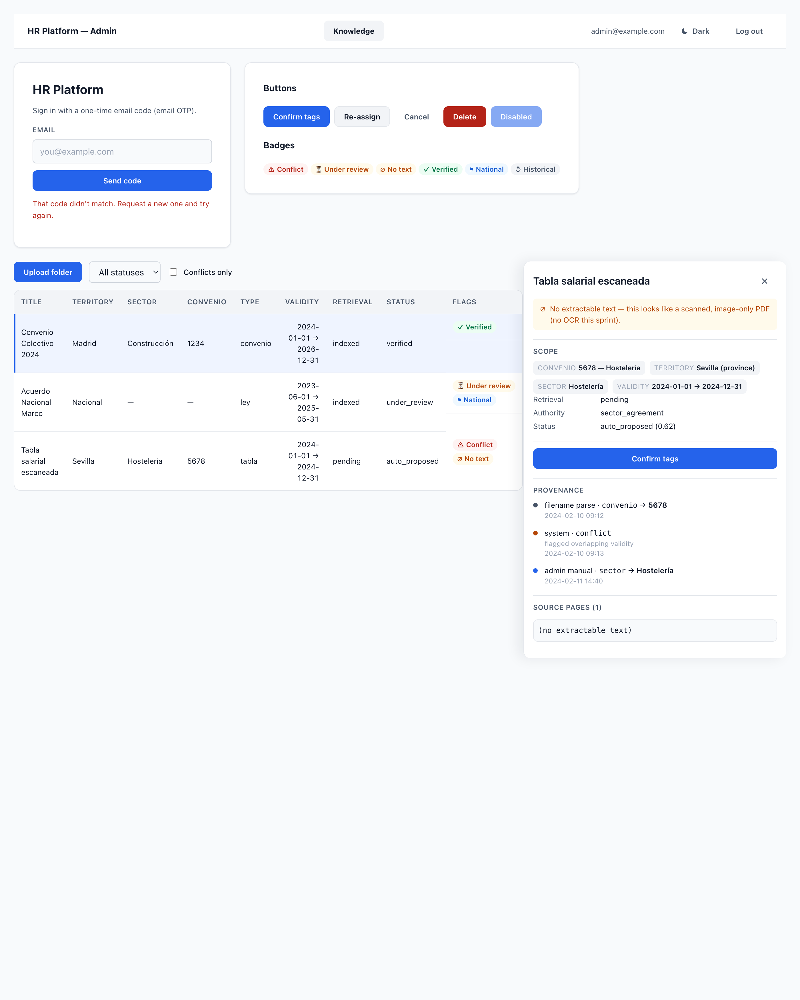
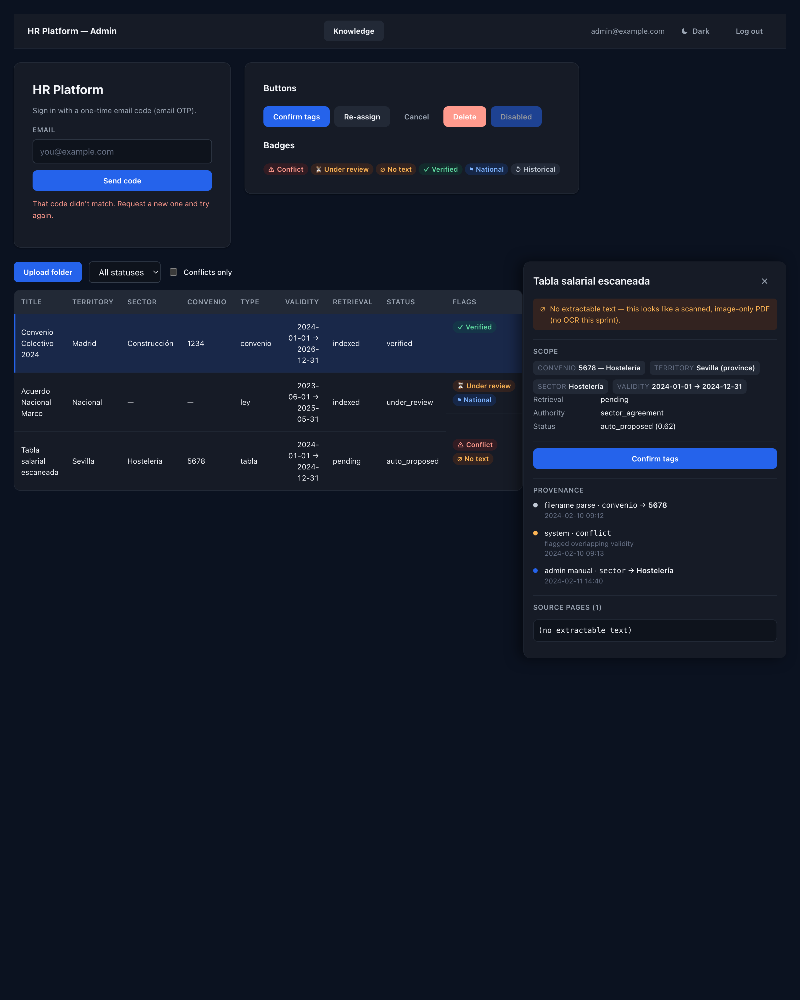

# Design-system adoption — hr-frontend

Visual-only refactor of `hr-frontend` onto the design system in
`hr-docs/design-system.md` (per **ADR-0012**: vanilla CSS + tokens, no Tailwind).
No behavior, routing, state, data, or API changes. Only new dependency: `@fontsource/inter`.

## What changed

### Tokens + theming (`src/index.css`)
- Rebuilt the stylesheet around a **token layer** in `:root` (light values): brand/accent,
  semantic state (`--danger/-bg`, `--warning/-bg`, `--success/-bg`, `--info/-bg`,
  `--neutral/-bg`), surfaces & text, borders, the 4px spacing scale (`--space-1..8`),
  radii (`--radius-sm/md/lg` + `--radius-pill`), shadows (`--shadow-sm/--shadow-panel`),
  and the type scale (`--text-xs..xl` with line-heights).
- Added a `[data-theme="dark"]` block that overrides the surface/text/border values and
  supplies brighter state foregrounds on low-alpha tints (§2). The accent and the *roles*
  of the state colors stay constant; only literal values shift.
- **Every component rule references `var(--…)`** — there is no raw hex left in any
  component rule. Existing semantic classNames (`card`, `muted`, `error`, `centered`,
  `shell*`, `docs-table`, `badge-*`, `detail`, `kv`, `timeline`, `page*`, `reassign`,
  `review-task`) were kept and re-expressed against tokens; nothing components use was renamed.

### Component classes (§5)
- Buttons: `.btn` base + `.btn-primary` / `.btn-secondary` / `.btn-ghost` / `.btn-danger`
  (+ `.btn-block` helper). 36px min hit target, visible disabled state.
- `.card`, `.panel` (detail drawer), `.well` (source/extracted text).
- `.input` / `.select` / `.textarea` / `.field` (uppercase label, help text, faint placeholder).
- `.badge` + the six status variants as **quiet colored foreground on a soft tint**
  (never saturated fills), each pairing color with text **and** an icon.
- `.docs-table`: sticky uppercase header on `--surface-raised`, `--text-sm` cells, row
  hover, selected row `--accent-weak` with a 2px `--accent` left border, numeric column
  (`.num`) right-aligned with `tabular-nums`.
- `.timeline` / `.timeline-item` with an origin-colored source dot
  (`filename_parse` neutral · `system` warning · `admin_manual` accent · `ai_agent` info).
- `.facet` scope chips (faint uppercase label + value on `--surface-raised`).

### Inter (§3)
- `@fontsource/inter` weights 400/500/600/700 imported once in `src/main.tsx`. Bundled
  locally by Vite (the build emits `inter-*.woff2/.woff` assets — **no external request**).
- Body font stack is `'Inter', <system stack>`; data uses `tabular-nums`.

### Theme toggle (§6 / ADR-0012)
- New `src/theme/` module: `context.ts` (context + `useTheme`), `ThemeProvider.tsx`,
  `ThemeToggle.tsx`. Initializes from `prefers-color-scheme`, then honors the user's
  explicit choice held **in React state only** — no `localStorage`/`sessionStorage`
  (persistence is deferred to the app's own settings later). The provider writes
  `data-theme` onto `<html>`. An unobtrusive `.btn-ghost` toggle sits in both shell headers.

### Accessibility floor (§6)
- Global `:focus-visible` → 2px `--accent` outline at 2px offset; no bare `outline:none`.
- ≥36px hit targets on `.btn`, `.select`, and `.checkbox` row controls.
- Transitions wrapped in `@media (prefers-reduced-motion: no-preference)`.
- Every status badge is color **+ text + icon**, so it is never a color-only distinction.

### Screens refactored (no functional change)
- **LoginPage**: controls wrapped in `.field`/`.input`; primary action `.btn .btn-primary`,
  "Use a different email" as `.btn .btn-ghost`. No more reliance on bare `form/input/button`
  tag selectors.
- **DocumentsPage**: `.docs-table` markup, toolbar uses `.btn`/`.select`, status `.badge-*`
  variants with icons, validity column marked `.num`.
- **DocumentDetailPanel**: `.panel` drawer, `.facet` chips for scope, `.timeline` for
  provenance, `.well` for source text, confirm = `.btn-primary`, re-assign = `.btn-secondary`.

### Copy pass (§7, visible words only)
- Login errors now say what happened + how to fix ("That code didn't match. Request a new
  one and try again.").
- Empty table state reads as health/guidance ("No documents yet — upload a convenio folder
  to ingest." / "No documents match these filters.").
- Confirm action keeps its name through the flow: **Confirm tags → Tags confirmed ✓**.
- Filter options and the empty-text badge use sentence case ("Under review", "No text").

## Token additions beyond the guide
The guide enumerates the tokens but leaves a few literal values to implementation. What I
added on top of the named set:
- `--radius-pill: 9999px` — the guide mentions "badges-as-pills are 9999px" inline; promoted
  to a named token for `.badge`.
- `--font-sans` — the Inter + system fallback stack as a single token.
- Per-token line-height companions (`--text-xs-lh` … `--text-xl-lh`) so the type scale's
  line-heights are tokenized, not inlined.
- Dark-theme state tints are expressed as low-alpha `rgba()` of the light foregrounds, and a
  dark `--accent-weak` alpha — the guide specifies "low-alpha tints" without exact values.
- A `.notice` helper (warning-tinted inline callout) for the panel's empty-text message, and
  `.col-empty` for the empty-table cell — both token-based.

## Verification
- `npm run build` (tsc -b + vite build): **clean**. Inter emitted as local woff2/woff.
- `npm run lint`: the only two errors are **pre-existing** `react-hooks/set-state-in-effect`
  findings in untouched logic (`DocumentsPage` L33, `DocumentDetailPanel` L168). Confirmed
  identical against a stash of the baseline — this change introduces **zero** new lint errors.
- **No-hex-leak check (both themes):** every component rule uses `var(--…)`. The only literal
  hex outside the `:root` / `[data-theme="dark"]` token blocks lives inside `@media print`
  (intentional). Flipping to dark shows no stuck-light surface — cards, panel, table header,
  wells, badges, facets, timeline, notice, and the login card all flip via `data-theme`.
- **Print:** `@media print` forces the light/black-on-white token set regardless of the active
  theme, drops shadows, outlines badges, and hides `.btn` controls. Verified by printing the
  preview **from the dark theme** to PDF (`docs/design-adoption/print-from-dark.pdf`) — it
  renders black-on-white.

## Screenshots
Rendered from the actual built design-system CSS applied to representative login + documents +
detail markup (the live admin screens require a running backend + auth).

Light:

Dark:

Print (from dark theme) → `docs/design-adoption/print-from-dark.pdf`.

## Constraints honored
No Tailwind, no CSS-in-JS, no component library. No routing/state/data/API changes. Theme
state is in memory only. All changes are contained within `hr-frontend`.
